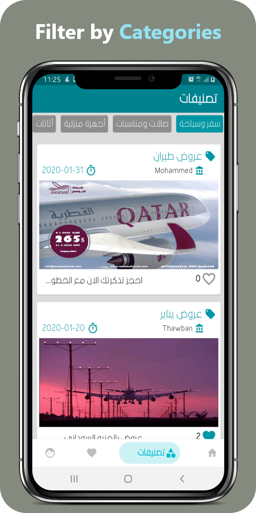
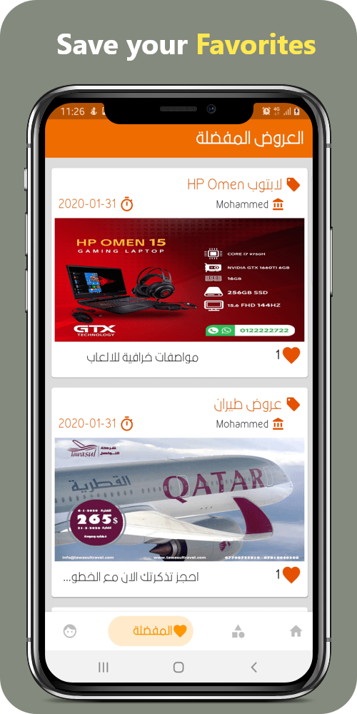
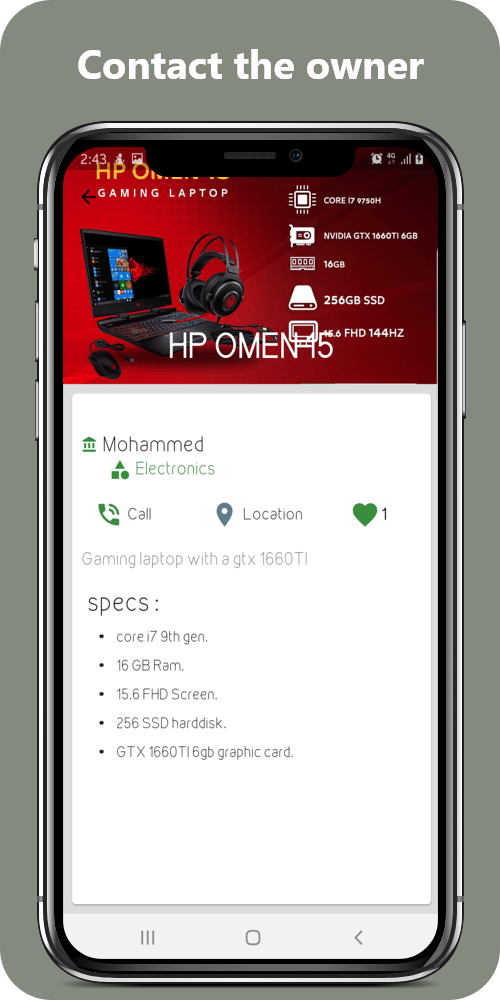
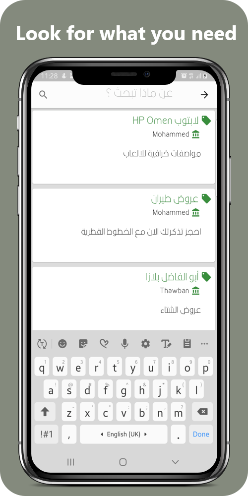

# Bazar Flutter
Bazar platform has many advantages over other e-marketing platforms, it aims to provide consumers' needs for products and services at the lowest prices by providing all the discounts and special offers in one place to facilitate the customer's access to distinctive products and services.

## ScreenShots:

         

## App Features
1. User can list and view offers.
2. User can add offers to his favorites list.

## App architecture
Based on mvvm architecture and repository pattern.

### The app includes the following main components:

* A local database that servers as a single source of truth for data presented to the user.
* A web api service.
* A repository that works with the database and the api service, providing a unified data interface.
* A ViewModel that provides data specific for the UI.
* The UI, which shows a visual representation of the data in the ViewModel.
* Unit Test cases for API service, Database, Repository and ViewModel.

### App Packages:
* **data** - contains :
  * api - contains the api classes to make api calls to MovieDB server, using Retrofit.
  * local - contains the db classes to cache network data.
  * repository - contains the repository classes, responsible for triggering api requests and saving the response in the database.
* **di** - contains dependency injection classes, using Dagger2.
* **ui** - contains classes needed to display Activity and Fragment.
* **util** - contains classes needed for activity/fragment redirection, ui/ux animations.

### App Specs
* Minimum SDK 16
* Java8 (in master branch) 
* MVVM Architecture
* Android Architecture Components (LiveData, Lifecycle, ViewModel, Room Persistence Library, ConstraintLayout)
* Dagger 2 for dependency injection.
* Retrofit 2 for API integration.
* Gson for serialisation.
* Mockito for implementing unit test cases
* Picasso for image loading.
------
## App link
